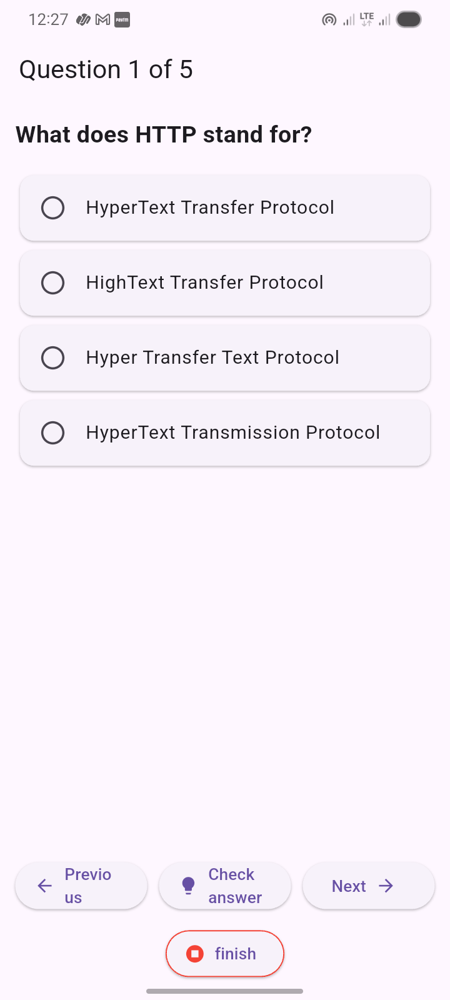
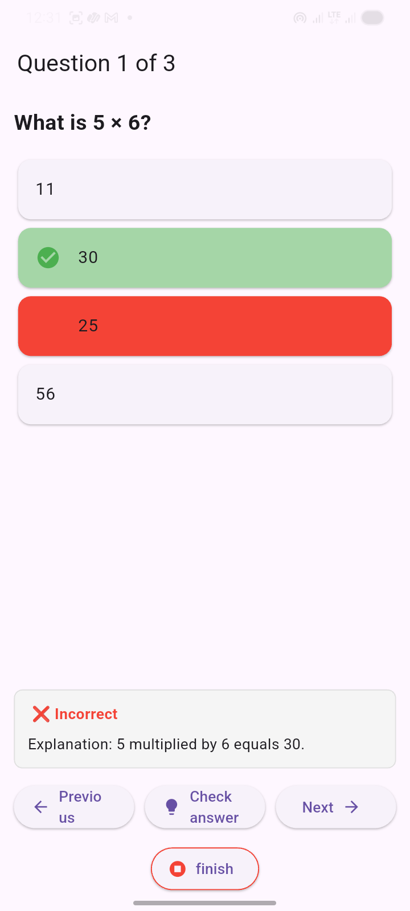
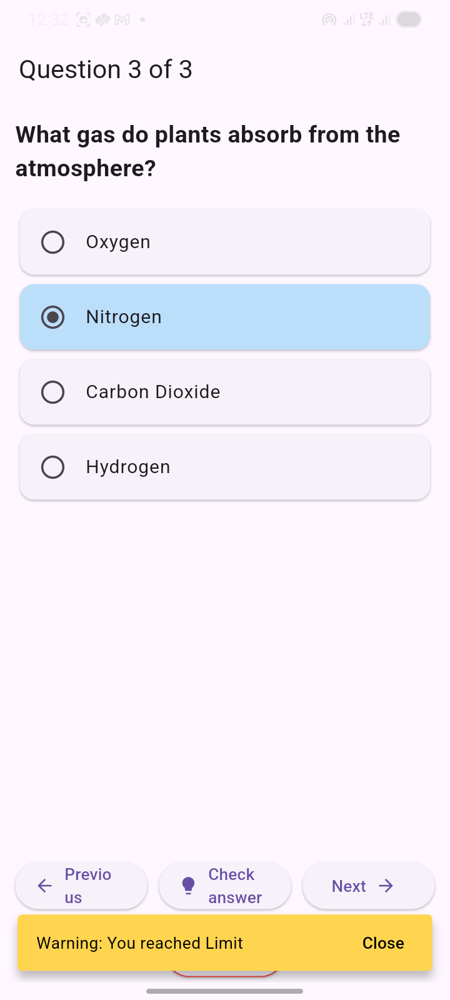
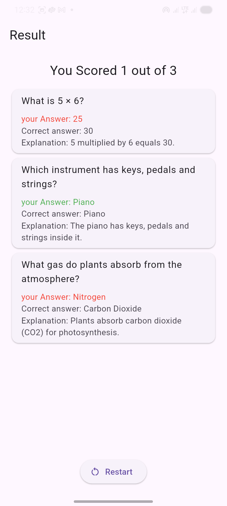
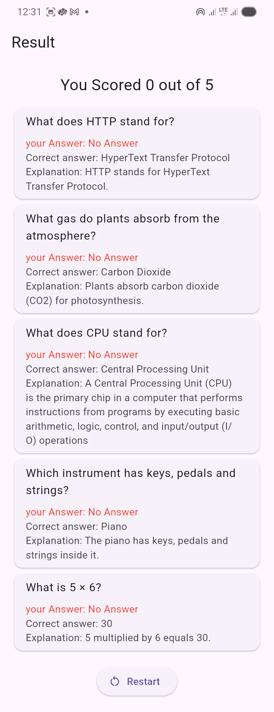

# quiz_app

This is a simple quiz app where quizzes are stored locally and tested with the user.

### 🔥 Note :

> Here, I am not used any APIs to test the code

### build app locally

``` bash
flutter build apk --release --verbose
```

1. home screen :


2. question screen: 

| first | check answer |
| ----- | ------------ |
|  |  |

3. warning if you cross the limit



4. Result screen 
   - if answers selected:
    

   - if answer not selected: 
    